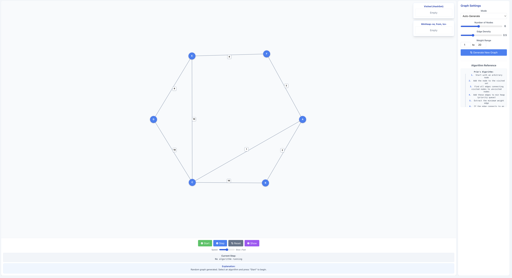

# MST Algorithm Visualizer

An interactive web application for visualizing Minimum Spanning Tree (MST) algorithms in action. Built to make graph algorithms more accessible and easier to understand through visual representation.



**[🚀 Try it live: mst-visualizer-xavieragostinos-projects.vercel.app](https://mst-visualizer-xavieragostinos-projects.vercel.app/)**

## Motivation

While studying for Harvard's COMPSCI 1240 (Design and Analysis of Algorithms) Midterm, I found myself struggling to fully understand the nuances of minimum spanning tree algorithms by just reading textbooks or watching lecture videos. I searched for interactive tools that could help me visualize these algorithms step-by-step, but couldn't find any that matched what I needed.

So I decided to build one myself! This project was born out of a genuine need to better understand these fundamental algorithms through visualization, and I'm sharing it in the hope that it can help other students facing similar challenges.

## Features

- **Interactive Graph Visualization**: Clearly see how algorithms find minimum spanning trees
- **Two Algorithm Implementations**:
  - Prim's algorithm (grows a tree from a single starting vertex)
  - Kruskal's algorithm (sorts edges by weight and adds them if they don't create cycles)
- **Step-by-Step Execution**: Watch algorithms progress one step at a time with detailed explanations
- **Dynamic Data Structure Visualization**: 
  - For Prim's: See the visited set and Min-Heap priority queue update in real-time
  - For Kruskal's: View sorted edges and Union-Find components as they evolve
- **Graph Creation Options**:
  - Auto-generate random graphs with configurable parameters
  - Manual mode for creating custom graphs from scratch
  - Control edge density, node count, and weight ranges
- **Educational Features**:
  - Algorithm reference guide with pseudocode
  - Color-coded edges and nodes to indicate algorithm state
  - Detailed explanations at each step

## Technologies Used

- React.js
- Tailwind CSS
- JavaScript (ES6+)
- Lodash

## Installation and Usage

### Live Demo
The easiest way to try the application is through the live demo:
**[mst-visualizer-xavieragostinos-projects.vercel.app](https://mst-visualizer-xavieragostinos-projects.vercel.app/)**

### Local Setup
If you prefer to run the application locally:

#### Prerequisites
- Node.js (v14.0 or higher)
- npm (v6.0 or higher)

#### Setup
1. Clone the repository
   ```bash
   git clone https://github.com/xavieragostino/mst-visualizer.git
   cd mst-visualizer
   ```

2. Install dependencies
   ```bash
   npm install
   ```

3. Start the development server
   ```bash
   npm start
   ```

4. Open your browser and navigate to `http://localhost:3000`

### How to Use

1. **Select an Algorithm**: Choose between Prim's algorithm and Kruskal's algorithm
2. **Set Up a Graph**: 
   - Use auto-generate mode with custom parameters, or
   - Switch to manual mode to create your own graph
3. **Visualization Controls**:
   - Start: Begin the animation
   - Step: Move through the algorithm one step at a time
   - Reset: Clear the current execution
   - Show: Skip to the final MST result
4. **Learn**: Read the explanations for each step and refer to the algorithm reference

## Project Structure

```
src/
├── components/
│   └── MSTVisualizer/
│       ├── MSTVisualizer.js     # Main component
│       └── [Supporting files]   # Helper components and utilities
└── App.js                     # Root component
```

## Contributing

I built this project as an educational tool, and I'd love for it to grow with contributions from the community. Whether you're fixing bugs, adding features, or improving documentation, all contributions are welcome!

1. Fork the project
2. Create your feature branch (`git checkout -b feature/amazing-feature`)
3. Commit your changes (`git commit -m 'Add some amazing feature'`)
4. Push to the branch (`git push origin feature/amazing-feature`)
5. Open a Pull Request

### Ideas for Contributions
- Additional algorithms (Borůvka's algorithm)
- Export/import of graph configurations
- Interactive tutorials
- Advanced graph layout algorithms for more complex graphs
- Improved mobile responsiveness
- Accessibility enhancements

## About Me

I'm a junior at Harvard studying Computer Science with a passion for making complex topics more accessible through interactive tools. I believe visualization is a powerful way to understand algorithms and data structures, and I hope this project helps others in their learning journey.

Feel free to reach out with questions, suggestions, or just to connect!

## License

This project is open source and available under the [MIT License](LICENSE).

## Acknowledgments

- Thanks to all the professors and TFs in Harvard's CS department who've helped deepen my understanding of algorithms
- Inspired by various other algorithm visualization tools that have helped me learn
- Built with React and Tailwind CSS

---

Happy learning! 🍎
